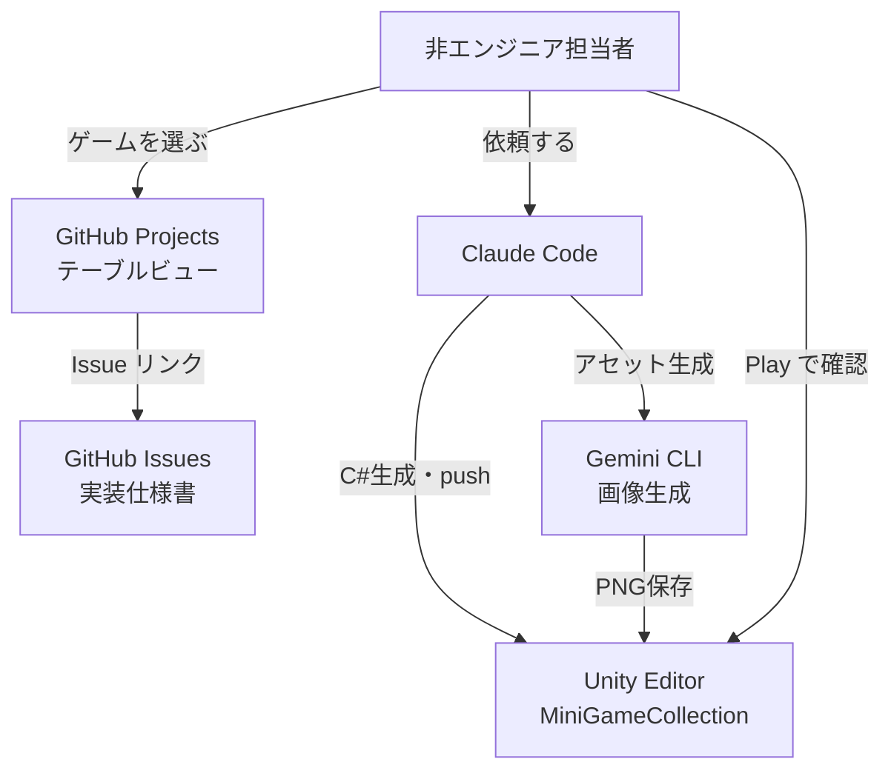

## はじめに

「ゲームのアイデアはたくさんあるけど、コードが書けない」——社内の非エンジニアからこんな声がありました。Claude Codeに話しかけるだけでUnityゲームが完成する仕組みを1日で構築したので、その全工程を共有します。

## この記事で扱うこと

- 100本のゲームアイデアをGitHub Issuesに体系的に登録する方法
- Claude Codeが自動でUnity C#スクリプトを生成するワークフロー
- カテゴリ別タブ付きTopMenuのミニゲーム集アーキテクチャ
- Gemini CLIによるゲームアセット（スプライト画像）の自動生成
- GitHub Projectsでスプレッドシート感覚の進捗管理

## 前提条件

- Unity 6（6000.x LTS）+ Unity Hub
- Claude Code（CLI版）
- GitHub アカウント + GitHub CLI（`gh`）
- Git
- プログラミング経験は不要（Claude Codeが全コードを生成）

## 全体アーキテクチャ



ポイントは**単一Unityプロジェクト方式**です。100本のゲームを毎回別プロジェクトにするのではなく、1つのプロジェクト（`MiniGameCollection`）にシーンを追加していきます。TopMenuからカテゴリ別にゲームを選べるミニゲーム集です。

## Phase 1: 100本のゲームアイデアをIssue化する

### ゲームアイデアの元データ

[cc_game_ideas](https://github.com/OumeiSatoKenta/cc_game_ideas) リポジトリに100本のアイデアがTSV形式で管理されています。

```
ID	タイトル	コアメカニクス	カテゴリ	工数
001	BlockFlow	色付きブロックをスワイプして同色を全て繋げる	puzzle	S
002	MirrorMaze	鏡を配置してレーザーをゴールへ誘導する	puzzle	M
...
```

### ラベル一括作成

```bash
# scripts/setup-labels.sh
gh label create "category:puzzle"     --color "0075ca" --description "パズル系 (001-020)"     --force
gh label create "category:action"     --color "e4e669" --description "アクション系 (021-040)" --force
gh label create "size:S" --color "bfd4f2" --description "工数S: 1日程度"   --force
gh label create "size:M" --color "5319e7" --description "工数M: 1週間程度" --force
gh label create "size:L" --color "b60205" --description "工数L: 2週間程度" --force
# ... 全12ラベル
```

### Issue一括登録（冪等設計）

```bash
# scripts/create-all-issues.sh（抜粋）
EXISTING_ISSUES=$(gh issue list --state all --limit 200 --json title -q '.[].title')

tail -n +2 "$DATA_FILE" | while IFS=$'\t' read -r ID TITLE MECHANICS CATEGORY SIZE; do
  ISSUE_TITLE="[${ID}] ${TITLE} (工数: ${SIZE})"

  # 既存チェック（冪等性）
  if echo "$EXISTING_ISSUES" | grep -qF "$ISSUE_TITLE"; then
    echo "  ⏭️  スキップ（既存）"
    continue
  fi

  gh issue create --title "$ISSUE_TITLE" --body "$BODY" \
    --label "category:${CATEGORY},size:${SIZE}"
  sleep 1  # レート制限対策
done
```

:::message
GitHub APIの504タイムアウトが40件目あたりで発生しましたが、冪等設計のおかげで再実行するだけで残り60件が処理されました。一括登録スクリプトは必ず冪等に作りましょう。
:::

### 概要の自動追加

最初のIssue登録では1行説明だけだったので、`game-summaries.jsonl`（100件の概要・コアループ・画面構成データ）を作成し、`gh issue edit --body-file` で一括更新しました。

## Phase 2: Unityプロジェクトの設計

### 単一プロジェクト・シーン追加方式

```
MiniGameCollection/Assets/
├── Scenes/
│   ├── TopMenu.unity          ← カテゴリ別タブのゲーム選択画面
│   ├── 001_BlockFlow.unity    ← ゲームごとにシーンを追加
│   └── ...
├── Scripts/
│   ├── Common/                ← 全ゲーム共通（SceneLoader等）
│   ├── TopMenu/               ← TopMenu専用
│   └── Game001_BlockFlow/     ← ゲームごとに独立フォルダ
├── Sprites/
│   └── Game001_BlockFlow/     ← ゲームごとのスプライト画像
├── Editor/
│   └── SceneSetup/            ← シーン自動構成Editorスクリプト
└── Resources/
    └── GameRegistry.json      ← 100ゲームの一覧データ
```

### GameRegistry.json

TopMenuが全ゲームを認識するためのマスターデータです。

```json
{
  "games": [
    {
      "id": "001",
      "title": "BlockFlow",
      "category": "puzzle",
      "size": "S",
      "sceneName": "001_BlockFlow",
      "description": "色付きブロックをスワイプして同色を全て繋げる",
      "implemented": true
    }
  ]
}
```

`implemented: false` のゲームはTopMenuでグレーアウト表示されます。新ゲームを実装するたびに `true` に更新するだけです。

### 共通スクリプト

```csharp
// SceneLoader.cs — 全ゲーム・TopMenuから使用
public static class SceneLoader
{
    public static void LoadGame(string sceneName)
    {
        if (string.IsNullOrEmpty(sceneName))
        {
            Debug.LogError("[SceneLoader] sceneName が null または空です");
            return;
        }
        SceneManager.LoadScene(sceneName);
    }

    public static void BackToMenu()
    {
        SceneManager.LoadScene("TopMenu");
    }
}
```

## Phase 3: TopMenu（ミニゲーム集ハブ）

7カテゴリのタブをタップすると、そのカテゴリのゲームカードが一覧表示されます。

### SceneSetup で1クリック構成

非エンジニアが Unity のインスペクタを手動設定する場面をゼロにするため、Editor スクリプトですべてを自動構成します。

```csharp
[MenuItem("Assets/Setup/TopMenu")]
public static void CreateTopMenuScene()
{
    // Canvas、タブ、スクロール、カードプレハブ、
    // EventSystem、BuildSettings登録まで全自動
}
```

:::message alert
Unity 6 で Input System Package を使っている場合、`StandaloneInputModule` ではなく `InputSystemUIInputModule` を使う必要があります。旧APIを使うとランタイムで `InvalidOperationException` が発生します。
:::

### 日本語フォント対応

TextMeshPro でカテゴリ名（パズル、アクション等）を表示するために、Noto Sans JP のフォントアセットを自動生成するEditorスクリプトも作成しました。

```csharp
[MenuItem("Assets/Setup/Generate Japanese Font")]
public static void GenerateFont()
{
    var font = AssetDatabase.LoadAssetAtPath<Font>("Assets/Fonts/NotoSansJP-Regular.ttf");
    var fontAsset = TMP_FontAsset.CreateFontAsset(font, 36, 5,
        GlyphRenderMode.SDFAA, 2048, 2048);
    // 日本語文字を追加してアセット保存
}
```

## Phase 4: 最初のゲーム実装（BlockFlow）

### Claude Code への依頼

```
ゲーム001 BlockFlow を作って
```

これだけで以下が自動生成されます:

- `BlockFlowGameManager.cs` — ゲーム制御・クリア判定
- `BoardManager.cs` — 5x5盤面・ランダム配置・スワイプ入力・BFS隣接判定
- `BlockController.cs` — ブロックの色・位置管理
- `BlockFlowUI.cs` — 手数表示・クリアパネル
- `Setup001_BlockFlow.cs` — シーン自動構成
- `GameRegistry.json` 更新（`implemented: true`）

### ハマりポイント: スプライトがプレハブに保持されない

`Sprite.Create()` で生成したスプライトはランタイムオブジェクトのため、プレハブにSerializeFieldで保持できません。

```csharp
// ❌ これではプレハブ保存時にスプライト参照が消える
var texture = new Texture2D(64, 64);
sr.sprite = Sprite.Create(texture, ...);
PrefabUtility.SaveAsPrefabAsset(obj, path); // sprite = null になる

// ✅ テクスチャをPNGで保存してアセットとして読み込む
System.IO.File.WriteAllBytes(texPath, texture.EncodeToPNG());
AssetDatabase.ImportAsset(texPath);
var sprite = AssetDatabase.LoadAssetAtPath<Sprite>(texPath);
```

### ハマりポイント: Input処理は一元管理すべき

当初、各ブロックの `Update()` で `Physics2D.OverlapPoint` を実行していましたが、複数ブロックが同時にドラッグ状態になる問題が発生。入力処理を `BoardManager` に一元化して解決しました。

```csharp
// BoardManager.Update() で入力を一元管理
if (mouse.leftButton.wasPressedThisFrame)
{
    Vector2 worldPos = Camera.main.ScreenToWorldPoint(mouse.position.ReadValue());
    var hit = Physics2D.OverlapPoint(worldPos);
    if (hit != null)
    {
        _draggedBlock = hit.GetComponent<BlockController>();
        _swipeStart = mouse.position.ReadValue();
    }
}
```

## Phase 5: ゲームアセット生成

### Gemini CLI でスプライト画像を自動生成

```bash
GEMINI_API_KEY=xxx gemini -p "Generate a 128x128 pixel game sprite of a red crystal gem block..." --yolo
```

ただし無料枠（1日20リクエスト）をすぐ使い切ってしまいました。代替として Python（Pillow）で直接描画する方式に切り替えました。

```python
from PIL import Image, ImageDraw

def create_gem_block(filename, base, highlight, shadow, size=128):
    img = Image.new('RGBA', (size, size), (0, 0, 0, 0))
    draw = ImageDraw.Draw(img)
    cx, cy = size // 2, size // 2

    # ダイヤモンド形の4面を描画
    draw.polygon([top, center, left], fill=highlight)     # 明るい面
    draw.polygon([bottom, center, right], fill=shadow)     # 暗い面
    # ...
```

5色のブロック + 盤面背景を生成し、`Resources.Load<Sprite>()` でランタイム読み込みしています。

## Phase 6: ゲーム003 GravitySwitch — 新パターンの実装

BlockFlow（スワイプ操作）の次に実装したのが **GravitySwitch**（重力方向切り替えパズル）です。

### ゲーム概要

4方向ボタン（▲▼◀▶）で重力方向を切り替え、ボールを滑らせてゴール（黄金のダイヤ）に誘導するパズル。3レベル収録（2手/2手/3手解答）。

### スクリプト構成

```
Scripts/Game003_GravitySwitch/
├── GravitySwitchGameManager.cs  — ゲーム状態・クリア判定
├── GravityManager.cs            — レベルデータ・タイル生成・ボール移動
├── TileView.cs                  — タイルの種別データ保持
├── GravityButtonHandler.cs      — ボタン→GravityManager.ApplyGravity(int)
└── GravitySwitchUI.cs           — 手数表示・クリアパネル
```

### 設計のポイント: 入力を一元管理

4方向ボタンの入力処理は `GravityButtonHandler` を経由してすべて `GravityManager` に委譲しています。各タイルやボールが入力を持たない設計です。

```csharp
// GravityButtonHandler.cs — ボタンに貼り付けるだけ
[RequireComponent(typeof(Button))]
public class GravityButtonHandler : MonoBehaviour
{
    [SerializeField] private GravityManager _gravityManager;
    [SerializeField] private int _direction; // 0=Up, 1=Down, 2=Left, 3=Right

    private void Start()
    {
        GetComponent<Button>().onClick.AddListener(
            () => _gravityManager?.ApplyGravity(_direction));
    }
}
```

### レベルデータの埋め込み

レベルは C# の多次元配列でハードコードしています（`0=空`, `1=壁`, `2=ゴール`）。

```csharp
private static readonly int[][,] _levels =
{
    // Level 1: 上→右で2手クリア
    new int[,]
    {
        {1,1,1,1,1,1,1},
        {1,0,0,0,0,2,1},  // ゴール at (1,5)
        {1,0,0,1,0,0,1},
        {1,0,0,0,0,0,1},  // ボール start at (3,1)
        {1,0,1,0,0,0,1},
        {1,0,0,0,0,0,1},
        {1,1,1,1,1,1,1},
    },
    // Level 2, Level 3...
};
```

タイルとボールはランタイムで動的生成（`GravityManager.InitLevel()`）し、スプライトは `Resources.Load<Sprite>()` で読み込みます。

### Pillow でスプライト生成

ゴールのダイヤ形・壁のレンガ模様・ボールを Python の Pillow で直接描画しました。

```python
# tile_goal.png — ゴールマーク（ダイヤ形）
img = Image.new('RGBA', (64, 64), (0, 0, 0, 0))
d = ImageDraw.Draw(img)
cx, cy = 32, 32
d.polygon([(cx,4),(60,cy),(cx,60),(4,cy)], fill=(255,215,0,255))
d.polygon([(cx,14),(50,cy),(cx,50),(14,cy)], fill=(255,240,100,255))
img.save(f'{out_dir}/tile_goal.png')
```

## Phase 7: GitHub Projects で進捗管理

GitHub Projectsのテーブルビューを設定し、スプレッドシート感覚で100本のゲームを管理できるようにしました。

```bash
# プロジェクト作成
gh project create --owner OumeiSatoKenta --title "Unity Game Progress"

# カスタムフィールド追加
gh project field-create 1 --owner OumeiSatoKenta \
  --name "カテゴリ" --data-type "SINGLE_SELECT" \
  --single-select-options "パズル,アクション,カジュアル,放置,リズム,育成,ユニーク"

gh project field-create 1 --owner OumeiSatoKenta \
  --name "工数" --data-type "SINGLE_SELECT" \
  --single-select-options "S,M,L"

# 全100件をProjectに追加
for i in $(seq 2 101); do
  gh project item-add 1 --owner OumeiSatoKenta \
    --url "https://github.com/OumeiSatoKenta/cc_unity_maker/issues/$i"
done
```

:::message
`gh project` コマンドには `read:project` と `project` スコープが必要です。`gh auth refresh -s read:project,project -h github.com` で追加できます。
:::

## Phase 8: スケジュール自動化 — 寝ている間にゲームを量産する

手動で「ゲームXXXを作って」と依頼するのは限界があります。Claude Code の **CronCreate** 機能を使って、5時間ごとに自動でゲームを実装し続ける仕組みを作りました。

### なぜ5時間？

Claude API にはレートリミット（トークン上限）があり、リセットまで **約5時間** かかります。1回の発火でレートリミットに達するまで連続実行し、次の5時間後にまた続きから再開する、という設計です。

### CronCreate でスケジュール登録

```
CronCreate({
  cron: "10 */5 * * *",   // 毎日 00:10, 05:10, 10:10, 15:10, 20:10
  durable: true,            // .claude/scheduled_tasks.json に永続化
  recurring: true,
  prompt: "..."
})
```

### 状態ファイルで進捗管理

どのゲームまで実装済みかを `.claude/game_schedule_state.json` で管理します。

```json
{
  "next_id": 4,
  "total": 100,
  "cron_job_id": "2841ba2f"
}
```

### cronプロンプトの構造

cronが発火したときに Claude が実行するプロンプトは3フェーズ構成です。

```
## フェーズ1: 状態読み込み
- game_schedule_state.json を読む
- next_id が 101 以上なら完了メッセージを出して終了

## フェーズ2: レートリミットまで連続実行
- /implement-game [ゲームID] をループ実行
- 正常完了 → next_id を +1 して次のゲームへ
- レートリミット/エラー → next_id を保持して停止（次回再試行）

## フェーズ3: cronの自己更新
- 古いジョブをCronDeleteして新しいCronCreateを実行
- → 7日の自動失効を回避
```

フェーズ2の「レートリミットまで連続実行」がポイントで、1回の発火で可能な限り多くのゲームを実装します。

### 承認プロンプトを無効化

自動実行中に承認ダイアログが出ると止まってしまいます。`.claude/settings.local.json`（gitignore済み）で `bypassPermissions` を設定して解決しました。

```json
{
  "permissions": {
    "defaultMode": "bypassPermissions"
  }
}
```

:::message alert
`bypassPermissions` はすべてのツール呼び出しを無承認で実行します。自動化の用途では有用ですが、信頼できる環境・リポジトリ限定で使用してください。
:::

### 動作フロー全体像

```
00:10 cron発火
  → game 004 実装・PR作成・mainマージ
  → game 005 実装・PR作成・mainマージ
  → game 006 実装... （レートリミットまで継続）
  → 停止、next_id を保存

05:10 cron再発火（レートリミットリセット後）
  → 続きの game XXX から再開
  ...
```

:::message
`durable: true` でジョブはディスクに永続化されますが、Claude Code が起動していないと発火しません。PCを使っている時間帯に自動実行される設計です。
:::

## 非エンジニアのワークフロー（最終形）

```
1. GitHub Projects でゲームを選ぶ（工数Sでフィルター）
      ↓
2. Claude Code に「ゲームXXX を作って」と依頼
      ↓
3. 「アセットを生成して」で画像作成（オプション）
      ↓
4. Unity Editor で Assets > Setup > XXX を実行
      ↓
5. Play ボタンで動作確認
      ↓
6. 問題があれば自然言語でフィードバック
      ↓
7. 完成！Issue をクローズして次のゲームへ
```

## まとめ

- **Claude Code + Unity** で、非エンジニアが「作って」と言うだけでゲームが完成する仕組みを1日で構築した
- **単一プロジェクト・シーン追加方式** により、100本のゲームを1つのUnityプロジェクトで管理できる
- **SceneSetup Editorスクリプト** により、非エンジニアがインスペクタを触る場面をゼロにした
- **GitHub Issues + Projects** で、スプレッドシート感覚の進捗管理を実現
- **CronCreate によるスケジュール自動化** で、寝ている間もゲームが量産され続ける仕組みを実現
- Unity 6 の新Input System対応や、スプライトのアセット保存など、実装で得たハマりポイントをナレッジとして蓄積

## 現在の進捗

| ゲームID | タイトル | 実装状態 |
|---|---|---|
| 001 | BlockFlow | ✅ 完了 |
| 002 | MirrorMaze | ✅ 完了 |
| 003 | GravitySwitch | ✅ 完了 |
| 004〜100 | 97本 | 🔄 スケジュール自動実行中 |

## この記事について

- **AI記載率**: 約90%（Claude Codeで設計・実装・記事生成を行い、筆者が方針判断・動作確認・フィードバック）
- **動作確認**: 未確認（これから実施予定）

## 参考リンク

- [cc_unity_maker リポジトリ](https://github.com/OumeiSatoKenta/cc_unity_maker)
- [cc_game_ideas リポジトリ](https://github.com/OumeiSatoKenta/cc_game_ideas)
- [Unity Game Progress（GitHub Projects）](https://github.com/users/OumeiSatoKenta/projects/1)
- [Claude Code](https://claude.ai/code)
- [Gemini CLI](https://github.com/google-gemini/gemini-cli)
