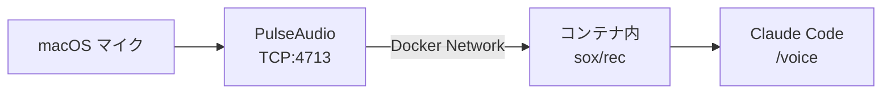

## この記事について

- **AI記載率**: 約65% — Claude Codeで生成し、筆者が構成指示・編集・加筆
- **動作確認**: 記事内のコマンド・設定はすべて筆者が実行確認済み

## はじめに

### Claude Codeをセキュアに使うために

Claude Codeはターミナルで動くAIコーディングエージェントです。ファイルの読み書き、シェルコマンドの実行、gitの操作まで自律的に行うため、実行環境のセキュリティを考える必要があります。

公式ドキュメントでは、セキュアな実行環境として2つのアプローチが紹介されています。

- **sandbox（`--sandbox`）**: ファイルシステムやネットワークアクセスを制限した隔離環境で実行する
- **[DevContainer](https://code.claude.com/docs/ja/devcontainer)**: Dockerコンテナ内に開発環境を閉じ込め、ホストOSへの影響を遮断する。公式の[リファレンス実装](https://github.com/anthropics/claude-code/tree/main/.devcontainer)も提供されている

公式リファレンス実装にはiptablesで接続先を許可サービスのみに制限するファイアウォールも組み込まれており、`claude --dangerously-skip-permissions` での無人操作も安全に行えます。

### なぜ筆者はDevContainerを使うのか

筆者はSREとしてDevContainerで開発環境を統一しており、Claude Codeもその中で動かしています。コンテナの外に出られないため、ホストのファイルやクレデンシャルに触れることなく、安心してエージェントに作業を任せられます。

### 本題: /voice が使えない問題

ところが一つ困ったことがあります。Claude Codeの **`/voice` コマンド**（マイク入力で音声指示を出せる機能）がDevContainer内では動きません。

```text
ALSA lib pcm.c:2666:(snd_pcm_open_noupdate) Unknown PCM default
```

Docker for Macはオーディオデバイスのパススルーをサポートしておらず、`--device` マウントでは解決できません。この記事では、**PulseAudioをTCPサーバーとして起動し、コンテナからネットワーク経由でマイクにアクセスする方法**を紹介します。

## アーキテクチャ



**PulseAudio**をネットワークオーディオサーバーとして利用し、TCP経由でオーディオストリームを転送します。

## 前提条件

- macOS（Docker Desktop for Mac）
- VS Code + Dev Containers拡張
- Homebrew

## セットアップ

### Step 1: macOSにPulseAudioをインストール（初回のみ）

> Step 1〜2 は **ホストPC（macOS）のターミナル**で実行します。DevContainerの中ではありません。

```bash
# ホストPCで実行
brew install pulseaudio
```

次にTCP接続を許可する設定を追加します。

```bash
echo "load-module module-native-protocol-tcp auth-ip-acl=127.0.0.1;172.16.0.0/12;192.168.0.0/16;10.0.0.0/8" >> \
  $(brew --prefix)/etc/pulse/default.pa
```

`auth-ip-acl` でローカルホストとDockerのプライベートネットワーク（`172.16.0.0/12`, `192.168.0.0/16`, `10.0.0.0/8`）のみに接続を制限しています。

:::message alert
**セキュリティ警告**: `auth-anonymous=1` は絶対に使わないでください。認証なしで誰でもマイクにアクセス可能になります。
:::

### Step 2: PulseAudioデーモンを起動（macOS再起動のたびに必要）

```bash
pulseaudio --exit-idle-time=-1 --daemon
```

`--exit-idle-time=-1` でアイドルタイムアウトを無効にします。`caps.c` の警告が出ることがありますが、動作に影響はありません。

### Step 3: devcontainer.jsonの設定

`containerEnv` でPulseAudio接続用の環境変数を追加します。

```json
{
  "name": "my-project",
  "image": "mcr.microsoft.com/devcontainers/base:bookworm",
  "containerEnv": {
    "PULSE_SERVER": "tcp:host.docker.internal:4713",
    "AUDIODRIVER": "pulseaudio"
  },
  "postCreateCommand": "bash .devcontainer/install-tools.sh"
}
```

| 設定 | 役割 |
|------|------|
| `PULSE_SERVER` | コンテナからホストのPulseAudioへの接続先。`host.docker.internal` はDocker Desktop固有のホスト参照DNS |
| `AUDIODRIVER` | SoX（Claude Codeが内部で使う録音ツール）にPulseAudioドライバを使わせる |

これらはSoX/PulseAudioのみに関係し、Claude Codeの動作には影響しません。

### Step 4: install-tools.shにオーディオパッケージを追加

`postCreateCommand` で実行される `install-tools.sh` に以下を追加します。

```bash
# PulseAudio client (for Claude Code /voice in DevContainer)
sudo apt-get update -qq && sudo apt-get install -y -qq \
  pulseaudio-utils \
  sox \
  libsox-fmt-pulse \
  libasound2-plugins

# ALSAのデフォルト出力をPulseAudioにリダイレクト
cat <<'ASOUNDRC' > "$HOME/.asoundrc"
pcm.!default {
    type pulse
}
ctl.!default {
    type pulse
}
ASOUNDRC
```

各パッケージの役割：

| パッケージ | 役割 |
|-----------|------|
| `pulseaudio-utils` | `pactl` 等のPulseAudioクライアントツール |
| `sox` | `rec` コマンド（録音）を含むオーディオ処理ツール |
| `libsox-fmt-pulse` | SoXのPulseAudio入出力プラグイン |
| `libasound2-plugins` | ALSAからPulseAudioへのリダイレクトに必要な共有ライブラリ（`libasound_module_pcm_pulse.so`） |

`~/.asoundrc` はALSAのデフォルト出力先をPulseAudioに変更する設定です。SoX含むALSAアプリケーションがPulseAudio経由で動作するようになります。

> **注意**: 設定を反映するにはコンテナの再ビルドが必要です。VS Code: `Cmd+Shift+P`（Command Palette）→ `Dev Containers: Rebuild Container`

### Step 5: 動作確認

> Step 5 は**DevContainer内のターミナル**で実行します。

```bash
# 1. PulseAudio接続テスト
pactl info
```

以下のように表示されればOKです。

```text
Server String: tcp:host.docker.internal:4713
Server Name: pulseaudio
Is Local: no
```

```bash
# 2. 録音テスト（1秒間）
rec -t wav /tmp/test.wav trim 0 1
```

`Input File : 'default' (pulseaudio)` と表示され、ALSAエラーなく完了すればOKです。

```bash
# 3. Claude Codeで /voice を実行
claude
# → /voice → Spaceキー長押しで録音開始
```

## まとめ

- DevContainer内でClaude Code `/voice` を使うには、**PulseAudio TCP転送**で解決できる
- macOS側は `brew install pulseaudio` + `default.pa` にTCPモジュール設定 + デーモン起動
- コンテナ側は `containerEnv`（`PULSE_SERVER`, `AUDIODRIVER`）+ パッケージ4つ + `.asoundrc`

## シリーズ記事

この記事は「Claude Code実践」シリーズの一部です。

1. **DevContainer内でClaude Codeの /voice を使う** ← 本記事

## 参考リンク

- [Claude Code — 開発コンテナ（公式ドキュメント）](https://code.claude.com/docs/ja/devcontainer)
- [Claude Code DevContainer リファレンス実装（GitHub）](https://github.com/anthropics/claude-code/tree/main/.devcontainer)
- [PulseAudio Documentation](https://www.freedesktop.org/wiki/Software/PulseAudio/Documentation/)
- [Docker Desktop — Networking features](https://docs.docker.com/desktop/networking/)
- [ALSA Project — .asoundrc](https://www.alsa-project.org/wiki/Asoundrc)
- [SoX — Sound eXchange](https://sox.sourceforge.net/)
