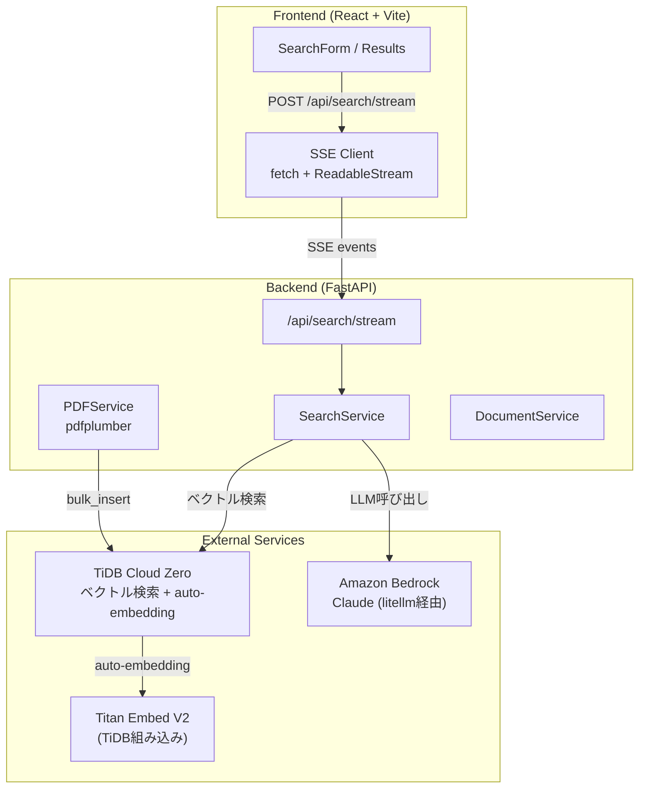

## はじめに

「社内PDFを検索できるAIチャットが欲しい」――RAG（Retrieval-Augmented Generation）は、こうしたニーズに応えるための定番アーキテクチャです。しかし、いざ作ろうとすると**ベクトルDB選定、Embeddingモデルの管理、ストリーミング対応、フロントエンドのリッチ表示**と、考えることが多く手が止まりがちです。

この記事では、**TiDB Cloud Zero**（ベクトルDB）+ **Amazon Bedrock**（LLM）+ **FastAPI** + **React** を使い、PDF RAGアプリをゼロから構築します。特に以下の点にフォーカスします。

- **pytidb の auto-embedding**: Embeddingモデルの管理が不要。INSERT するだけで自動ベクトル化
- **SSE ストリーミング**: LLM の回答をトークン単位でリアルタイム表示
- **実際にハマったポイント**: 日本語PDF文字化け、IAM権限、バンドルサイズ問題など

## この記事で作るもの

PDFをアップロードし、自然言語で質問すると、PDFの内容に基づいてAIが回答するWebアプリです。

**主な機能:**
- PDFアップロード & 自動チャンク分割・ベクトル化
- 自然言語によるベクトル検索
- LLM（Claude）による回答生成（SSEストリーミング）
- Markdownレンダリング + シンタックスハイライト



## 前提条件

| 項目 | バージョン / 要件 |
|------|-------------------|
| Python | 3.11 以上 |
| Node.js | 18 以上 |
| AWS アカウント | Bedrock の Claude モデルへのアクセス権 |
| TiDB Cloud Zero | アカウント不要（curl で即時作成） |

TiDB Cloud Zero のインスタンス作成は、[前回の記事](tidb-cloud-zero-intro)で詳しく解説しています。

## 1. プロジェクト構成

```
pdf-rag/
├── backend/
│   ├── app/
│   │   ├── models/
│   │   │   └── document.py      # TableModel定義
│   │   ├── services/
│   │   │   ├── pdf_service.py   # PDF処理
│   │   │   ├── document_service.py  # CRUD操作
│   │   │   └── search_service.py    # RAG検索 + SSE
│   │   ├── routers/
│   │   │   └── search.py        # APIエンドポイント
│   │   └── config.py            # 設定管理
│   └── pyproject.toml
└── frontend/
    └── src/
        ├── lib/api.ts           # SSEクライアント
        ├── hooks/useSearch.ts   # ストリーミングフック
        └── components/          # UIコンポーネント
```

## 2. pytidb でベクトル検索テーブルを定義する

pytidb の最大の魅力は **auto-embedding** です。テーブル定義で `VectorField(source_field="text")` を指定するだけで、`INSERT` 時に自動的にベクトル化してくれます。外部の Embedding API キーは不要です。

```python
# backend/app/models/document.py
from datetime import datetime, timezone
from typing import Optional

from pytidb.embeddings import EmbeddingFunction
from pytidb.schema import Field, FullTextField, TableModel

from app.config import get_settings

# TiDB Cloud 組み込みの Embedding モデル（APIキー不要）
embed_fn = EmbeddingFunction(get_settings().EMBEDDING_MODEL)
# EMBEDDING_MODEL = "tidbcloud_free/amazon/titan-embed-text-v2"


class Document(TableModel):
    """PDF文書のメタデータ"""
    __tablename__ = "documents"

    id: int = Field(primary_key=True)
    filename: str = Field()
    title: str = Field(default="")
    page_count: int = Field(default=0)
    chunk_count: int = Field(default=0)
    status: str = Field(default="extracting")
    error_message: str = Field(default="")
    uploaded_at: datetime = Field(
        default_factory=lambda: datetime.now(timezone.utc)
    )
    completed_at: Optional[datetime] = Field(default=None)


class Chunk(TableModel):
    """PDFから抽出したテキストチャンク"""
    __tablename__ = "chunks"

    id: int = Field(primary_key=True)
    document_id: int = Field()
    text: str = FullTextField()  # フルテキスト検索対応
    text_vec: list[float] = embed_fn.VectorField(source_field="text")  # ← ここがポイント
    page_number: int = Field(default=0)
    chunk_index: int = Field(default=0)
```

### ポイント解説

| 要素 | 説明 |
|------|------|
| `Field` | `pytidb.schema.Field` を使用。`pydantic.Field` では `primary_key` が認識されない |
| `FullTextField()` | MySQL の `FULLTEXT` インデックスに対応。キーワード検索にも使える |
| `embed_fn.VectorField(source_field="text")` | `text` カラムの内容を自動的にベクトル化して `text_vec` に格納 |
| `EmbeddingFunction` | `tidbcloud_free/amazon/titan-embed-text-v2` を指定。TiDB Cloud 組み込みなので API キー不要 |

:::message alert
**pytidb の `Field` に注意**: `from pydantic import Field` ではなく `from pytidb.schema import Field` を使ってください。pydantic の Field では `primary_key=True` が SQLAlchemy に伝わらず、テーブル作成時にエラーになります。また、`table=True` の指定も不要です。
:::

テーブル作成は `init_db` スクリプトで実行します。

```python
# backend/scripts/init_db.py
from pytidb import TiDBClient
from app.config import get_settings
from app.models.document import Document, Chunk

settings = get_settings()
db = TiDBClient.connect(
    host=settings.TIDB_HOST,
    port=settings.TIDB_PORT,
    username=settings.TIDB_USERNAME,
    password=settings.TIDB_PASSWORD,
    database=settings.TIDB_DATABASE,
    enable_ssl=True,
)

db.create_table(schema=Document, if_exists="skip")
db.create_table(schema=Chunk, if_exists="skip")
print("Tables created successfully")
```

:::message alert
**pytidb の API 名に注意**: ドキュメントと実装に乖離があります。
- `ssl_verify` ではなく `enable_ssl`
- `mode="exist_ok"` ではなく `if_exists="skip"`
- `get_table` ではなく `open_table`

確実な確認方法: `python3 -c "import inspect; from pytidb.client import TiDBClient; print(inspect.signature(TiDBClient.connect))"`
:::

## 3. PDF 処理パイプライン

PDF からテキストを抽出し、チャンクに分割して TiDB に格納するパイプラインです。


### 3.1 テキスト抽出（pdfplumber）

```python
# backend/app/services/pdf_service.py
import io
import re
from dataclasses import dataclass

import pdfplumber

CHUNK_SIZE = 500
CHUNK_OVERLAP = 100


@dataclass
class PageText:
    number: int
    text: str


@dataclass
class ChunkData:
    text: str
    page_number: int
    chunk_index: int


class PDFService:
    def extract_text(self, pdf_bytes: bytes) -> list[PageText]:
        """PDFの各ページからテキストを抽出する"""
        pages = []
        with pdfplumber.open(io.BytesIO(pdf_bytes)) as pdf:
            for i, page in enumerate(pdf.pages, start=1):
                text = page.extract_text() or ""
                if text.strip():
                    pages.append(PageText(number=i, text=text))
        return pages
```

:::message alert
**pypdf ではなく pdfplumber を使う理由**: pypdf の `page.extract_text()` は CID-keyed フォント（日本語PDFで多用される CMap ベースのエンコーディング）のデコードに失敗し、`ʹ`, `Ε`, `ɻ` のような意味不明な文字に化けます。pdfplumber は内部で pdfminer.six を使用しており、CJK フォントの処理が堅牢です。
:::

### 3.2 チャンク分割

500文字ごとにオーバーラップ100文字で分割します。文の途中で切れないよう、句読点で分割してからチャンクを構成します。

```python
    def split_into_chunks(
        self,
        pages: list[PageText],
        chunk_size: int = CHUNK_SIZE,
        overlap: int = CHUNK_OVERLAP,
    ) -> list[ChunkData]:
        """ページテキストをオーバーラップ付きチャンクに分割する"""
        chunks: list[ChunkData] = []
        buffer = ""
        current_page = 1
        chunk_index = 0

        for page in pages:
            current_page = page.number
            sentences = _split_sentences(page.text)
            for sentence in sentences:
                buffer += sentence
                if len(buffer) >= chunk_size:
                    chunks.append(
                        ChunkData(
                            text=buffer,
                            page_number=current_page,
                            chunk_index=chunk_index,
                        )
                    )
                    buffer = buffer[-overlap:]  # 末尾 overlap 文字を次のバッファに
                    chunk_index += 1

        if buffer.strip():
            chunks.append(
                ChunkData(
                    text=buffer,
                    page_number=current_page,
                    chunk_index=chunk_index,
                )
            )
        return chunks


def _split_sentences(text: str) -> list[str]:
    """句読点・改行で文を分割する（英語・日本語両対応）"""
    parts = re.split(r"(?<=[.!?。\n])\s?", text)
    return [p for p in parts if p]
```

> **正規表現のポイント**: `\s?` は look-behind の外に置いています。look-behind 内に入れると可変長エラー（`re.error: look-behind requires fixed-width pattern`）になります。

### 3.3 バックグラウンド処理で TiDB に格納

`bulk_insert` は auto-embedding を含むため同期ブロッキング処理です。FastAPI の `async def` 内で直接呼ぶとイベントループ全体がブロックされるため、`run_in_executor` でスレッドプールに逃がします。

```python
# backend/app/routers/documents.py（抜粋）
import asyncio
from concurrent.futures import ThreadPoolExecutor

executor = ThreadPoolExecutor(max_workers=2)

async def _process_pdf(doc_id: int, pdf_bytes: bytes):
    """バックグラウンドでPDFを処理する"""
    loop = asyncio.get_running_loop()
    await loop.run_in_executor(executor, _process_pdf_sync, doc_id, pdf_bytes)

def _process_pdf_sync(doc_id: int, pdf_bytes: bytes, pdf_service: PDFService) -> None:
    """同期処理（スレッドプールで実行される）"""
    db = get_db()
    doc_service = DocumentService(db)

    try:
        # 1. テキスト抽出（extracting ステータスは create_document() で設定済み）
        pages = pdf_service.extract_text(pdf_bytes)

        # 2. チャンク分割
        doc_service.update_status(doc_id, "chunking")
        chunks = pdf_service.split_into_chunks(pages)

        if not chunks:
            doc_service.mark_error(doc_id, "テキストを抽出できませんでした")
            return

        # 3. ベクトル化 & 格納（auto-embedding）
        doc_service.update_status(
            doc_id, "embedding",
            page_count=len(pages),
            chunk_count=len(chunks),
        )
        doc_service.save_chunks(doc_id, chunks)
        # save_chunks 内で status = "ready" に更新される

    except Exception as e:
        try:
            doc_service.mark_error(doc_id, "PDF処理中にエラーが発生しました")
        except Exception:
            pass  # mark_error 自体が失敗しても握りつぶす
```

:::message alert
**`async def` 内での同期ブロッキングに注意**: `bulk_insert`（auto-embedding 含む）を `async def` のバックグラウンドタスク内で直接実行すると、FastAPI のイベントループ全体がブロックされ、**他のリクエストも含めてサーバーが応答不能**になります。必ず `asyncio.run_in_executor(ThreadPoolExecutor)` でスレッドプールに逃がしてください。
:::

## 4. RAG 検索の実装

ベクトル検索でPDFチャンクを取得し、それをコンテキストとしてLLMに回答を生成させます。

```python
# backend/app/services/search_service.py
import litellm
from pytidb import TiDBClient
from app.config import Settings

SYSTEM_PROMPT = "You are a helpful assistant that answers questions based on provided context."

RAG_PROMPT_TEMPLATE = """Context information is below.
---------------------
{context}
---------------------
Given the context information and not prior knowledge, answer the query
in a detailed and precise manner. Answer in the same language as the query.

If the context does not contain enough information to answer, say so clearly.

Query: {question}
Answer:"""


class SearchService:
    def __init__(self, db: TiDBClient, settings: Settings):
        self._db = db
        self._chunk_table = db.open_table("chunks")
        self._settings = settings

    def _vector_search(
        self,
        question: str,
        document_ids: list[int] | None = None,
        limit: int = 5,
    ) -> list[dict]:
        """ベクトル検索を実行（document_idsで特定ドキュメントに絞り込み可能）"""
        query = self._chunk_table.search(question)
        if document_ids:
            query = query.filter({"document_id": {"$in": document_ids}})
        results = query.limit(limit).to_list()
        return results  # 実装ではさらに document_filename を付加する enrich 処理が続く

    def search(self, question: str, limit: int = 5):
        """RAG検索: ベクトル検索 → プロンプト構築 → LLM回答生成"""
        # 1. ベクトル検索
        chunks = self._vector_search(question, limit)

        if not chunks:
            return {"answer": "関連する情報が見つかりませんでした。", "chunks": []}

        # 2. プロンプト構築
        context = "\n\n".join(
            f"[Source: {c.get('document_filename', 'unknown')}, Page {c['page_number']}]\n{c['text']}"
            for c in chunks
        )
        prompt = RAG_PROMPT_TEMPLATE.format(context=context, question=question)

        # 3. LLM呼び出し（litellm経由でBedrock）
        response = litellm.completion(
            model=self._settings.LLM_MODEL,  # "bedrock/us.anthropic.claude-sonnet-4-20250514-v1:0"
            messages=[
                {"role": "system", "content": SYSTEM_PROMPT},
                {"role": "user", "content": prompt},
            ],
        )
        answer = response.choices[0].message.content

        return {"answer": answer, "chunks": chunks}
```

### pytidb のベクトル検索 API

```python
# 基本の検索
results = table.search("質問テキスト").limit(5).to_list()

# フィルタ付き検索（特定のドキュメントに絞る）
results = table.search("質問テキスト") \
    .filter({"document_id": {"$in": [1, 2, 3]}}) \
    .limit(5) \
    .to_list()
```

`search()` にテキストを渡すだけで、内部で自動的にベクトル化してコサイン類似度検索が実行されます。auto-embedding のおかげで、検索側でも Embedding API を意識する必要がありません。

:::message alert
**Bedrock の Inference Profile に注意**: litellm で Bedrock のモデルを指定する際、cross-region inference を使う場合は `us.` プレフィックス付きの inference profile ID が必要です。例: `bedrock/us.anthropic.claude-sonnet-4-20250514-v1:0`
:::

## 5. SSE ストリーミング実装

LLMの回答をトークン単位でリアルタイム表示するために、Server-Sent Events（SSE）を実装します。

### 5.1 SSE イベント設計

```
event: progress  → {"step": "searching", "message": "ベクトル検索中..."}
event: chunks    → {"chunks": [...]}
event: progress  → {"step": "generating", "message": "AIが回答を生成中..."}
event: delta     → {"content": "回答の"}      ← LLMトークン1つ分
event: delta     → {"content": "トークン"}     ← 繰り返し
event: delta     → {"content": "です。"}
event: done      → {}
```

進捗状況 → 検索結果 → 回答（トークン単位）の順に、1つの HTTP 接続でストリーミングします。

### 5.2 Backend（FastAPI）

```python
# backend/app/services/search_service.py（ストリーミング部分）
import json
from collections.abc import Generator


def _format_sse(event: str, data: dict) -> str:
    """SSEフォーマットの文字列を生成"""
    return f"event: {event}\ndata: {json.dumps(data, ensure_ascii=False)}\n\n"


class SearchService:
    # ... 省略 ...

    def search_stream(
        self,
        question: str,
        document_ids: list[int] | None = None,
        limit: int = 5,
    ) -> Generator[str, None, None]:
        """SSEストリーミングでRAG検索を実行"""

        # Step 1: ベクトル検索
        yield _format_sse("progress", {"step": "searching", "message": "ベクトル検索中..."})

        try:
            chunks = self._vector_search(question, document_ids, limit)
        except Exception:
            yield _format_sse("error", {"message": "ベクトル検索に失敗しました。"})
            yield _format_sse("done", {})
            return

        if not chunks:
            yield _format_sse("chunks", {"chunks": []})
            yield _format_sse("delta", {"content": "関連する情報が見つかりませんでした。"})
            yield _format_sse("done", {})
            return

        # Step 2: チャンク結果を送信
        yield _format_sse("chunks", {"chunks": chunks})
        yield _format_sse("progress", {"step": "generating", "message": "AIが回答を生成中..."})

        # Step 3: LLMストリーミング
        prompt = self._build_prompt(chunks, question)
        messages = [
            {"role": "system", "content": SYSTEM_PROMPT},
            {"role": "user", "content": prompt},
        ]

        try:
            response = litellm.completion(
                model=self._settings.LLM_MODEL,
                messages=messages,
                stream=True,  # ← ストリーミング有効
            )
            for chunk in response:
                content = chunk.choices[0].delta.content if chunk.choices else None
                if content:
                    yield _format_sse("delta", {"content": content})
        except Exception:
            # ストリーミング失敗時は非ストリーミングにフォールバック
            try:
                fallback = litellm.completion(
                    model=self._settings.LLM_MODEL,
                    messages=messages,
                )
                answer = fallback.choices[0].message.content or ""
                yield _format_sse("delta", {"content": answer})
            except Exception:
                yield _format_sse("error", {"message": "回答生成に失敗しました。"})

        yield _format_sse("done", {})
```

ルーター側は `StreamingResponse` で返すだけです。

```python
# backend/app/routers/search.py
from fastapi import APIRouter
from fastapi.responses import StreamingResponse

@router.post("/search/stream")
async def search_stream(req: SearchRequest, ...):
    return StreamingResponse(
        search_service.search_stream(
            question=req.question,
            document_ids=req.document_ids,
            limit=req.limit,
        ),
        media_type="text/event-stream",
        headers={
            "Cache-Control": "no-cache",
            "X-Accel-Buffering": "no",  # Nginx等のバッファリング無効化
        },
    )
```

> **なぜ同期ジェネレータで OK なのか**: FastAPI は同期ジェネレータを `StreamingResponse` に渡すと、内部で `iterate_in_threadpool` を使って自動的にスレッドプールで実行します。`async def` にする必要はありません。

:::message alert
**`stream=True` には別の IAM 権限が必要**: litellm で `stream=True` を指定すると、AWS Bedrock の `bedrock:InvokeModelWithResponseStream` アクションが呼ばれます。通常の `bedrock:InvokeModel` とは**別の IAM アクション**です。ストリーミング対応の IAM ポリシー例:

```json
{
  "Version": "2012-10-17",
  "Statement": [
    {
      "Effect": "Allow",
      "Action": [
        "bedrock:InvokeModel",
        "bedrock:InvokeModelWithResponseStream"
      ],
      "Resource": "arn:aws:bedrock:*::foundation-model/*"
    }
  ]
}
```

権限がない場合に備えて、非ストリーミングへのフォールバックも実装しておくと安心です。
:::

### 5.3 Frontend（React）

`EventSource` API は POST リクエストに対応していないため、`fetch` + `ReadableStream` で SSE をパースします。

```typescript
// frontend/src/lib/api.ts（SSEクライアント部分）
async function searchStream(
  req: SearchRequest,
  callbacks: StreamCallbacks,
  signal?: AbortSignal,
) {
  const res = await fetch("/api/search/stream", {
    method: "POST",
    headers: { "Content-Type": "application/json" },
    body: JSON.stringify(req),
    signal,
  });

  if (!res.ok) throw new Error(`API error ${res.status}`);

  const reader = res.body?.getReader();
  if (!reader) throw new Error("ReadableStream not supported");

  const decoder = new TextDecoder();
  let buffer = "";

  while (true) {
    const { done, value } = await reader.read();
    if (done) break;

    buffer += decoder.decode(value, { stream: true });

    // SSEイベントは \n\n で区切られる
    const parts = buffer.split("\n\n");
    buffer = parts.pop() ?? "";  // 不完全なイベントをバッファに保持

    for (const part of parts) {
      if (!part.trim()) continue;
      const lines = part.split("\n");
      let event = "";
      let data = "";
      for (const line of lines) {
        if (line.startsWith("event: ")) event = line.slice(7);
        else if (line.startsWith("data: ")) data = line.slice(6);
      }
      if (!event || !data) continue;

      let parsed: Record<string, unknown>;
      try {
        parsed = JSON.parse(data);
      } catch {
        continue;  // 壊れたデータは無視
      }

      switch (event) {
        case "progress":
          callbacks.onProgress(parsed.step as string, parsed.message as string);
          break;
        case "chunks":
          callbacks.onChunks(parsed.chunks as ChunkReference[]);
          break;
        case "delta":
          callbacks.onDelta(parsed.content as string);
          break;
        case "error":
          callbacks.onError(parsed.message as string);
          break;
        case "done":
          callbacks.onDone();
          break;
      }
    }
  }
}
```

### SSE パースのポイント

1. **`\n\n` で split**: SSE の仕様では、イベントは空行（`\n\n`）で区切られます
2. **`parts.pop()` でバッファ保持**: ネットワークチャンクの境界と SSE イベントの境界は一致しないため、最後の不完全な部分をバッファに残します
3. **`JSON.parse` の try/catch**: 壊れたデータでクラッシュしないよう保護します
4. **AbortController**: コンポーネントのアンマウント時やリクエストのキャンセル時に接続を切断します

React Hook でのステート管理:

```typescript
// frontend/src/hooks/useSearch.ts
export function useSearch() {
  const [state, setState] = useState<StreamSearchState>({
    progressMessage: "",
    chunks: [],
    answer: "",
    isStreaming: false,
    error: null,
  });
  const abortRef = useRef<AbortController | null>(null);

  const search = useCallback((req: SearchRequest) => {
    abortRef.current?.abort();
    const controller = new AbortController();
    abortRef.current = controller;

    setState({ ...INITIAL_STATE, isStreaming: true });

    api.searchStream(req, {
      onProgress: (_step, message) => {
        setState((prev) => ({ ...prev, progressMessage: message }));
      },
      onChunks: (chunks) => {
        setState((prev) => ({ ...prev, chunks, progressMessage: "" }));
      },
      onDelta: (content) => {
        // answer にトークンを逐次追加
        setState((prev) => ({
          ...prev,
          answer: prev.answer + content,
          progressMessage: "",
        }));
      },
      onError: (message) => {
        setState((prev) => ({ ...prev, error: message, isStreaming: false }));
      },
      onDone: () => {
        setState((prev) => ({ ...prev, isStreaming: false }));
      },
    }, controller.signal);
  }, []);

  // アンマウント時にクリーンアップ
  useEffect(() => {
    return () => { abortRef.current?.abort(); };
  }, []);

  return { search, streamState: state, isSearching: state.isStreaming };
}
```

## 6. フロントエンドのリッチ表示

LLM の回答は Markdown で返ってくるため、`react-markdown` でレンダリングし、コードブロックにはシンタックスハイライトを適用します。

### 6.1 パッケージインストール

```bash
npm install react-markdown remark-gfm react-syntax-highlighter
npm install -D @types/react-syntax-highlighter
```

### 6.2 バンドルサイズに注意

:::message alert
**`react-syntax-highlighter` のバンドルサイズ問題**: フルビルド（`Prism`）を使うとバンドルサイズが **1,114KB** に膨張します。`PrismLight` + 必要言語のみ登録で **545KB**（gzip: 170KB）に半減できます。
:::

```typescript
// PrismLight で必要な言語だけ登録する
import { PrismLight as SyntaxHighlighter } from "react-syntax-highlighter";
import { oneDark } from "react-syntax-highlighter/dist/esm/styles/prism";

// 必要な言語のみインポート
import python from "react-syntax-highlighter/dist/esm/languages/prism/python";
import typescript from "react-syntax-highlighter/dist/esm/languages/prism/typescript";
import tsx from "react-syntax-highlighter/dist/esm/languages/prism/tsx";
import javascript from "react-syntax-highlighter/dist/esm/languages/prism/javascript";
import sql from "react-syntax-highlighter/dist/esm/languages/prism/sql";
import bash from "react-syntax-highlighter/dist/esm/languages/prism/bash";
import shell from "react-syntax-highlighter/dist/esm/languages/prism/shell-session";
import json from "react-syntax-highlighter/dist/esm/languages/prism/json";

SyntaxHighlighter.registerLanguage("python", python);
SyntaxHighlighter.registerLanguage("typescript", typescript);
SyntaxHighlighter.registerLanguage("tsx", tsx);
SyntaxHighlighter.registerLanguage("javascript", javascript);
SyntaxHighlighter.registerLanguage("sql", sql);
SyntaxHighlighter.registerLanguage("bash", bash);
SyntaxHighlighter.registerLanguage("shell", shell);
SyntaxHighlighter.registerLanguage("json", json);
```

### 6.3 Markdown レンダリングコンポーネント

以下はエッセンスを抽出した簡略版です。実装では `SearchResults.tsx` 内にインラインで記述しています。

```tsx
import ReactMarkdown from "react-markdown";
import remarkGfm from "remark-gfm";

function AnswerDisplay({ answer }: { answer: string }) {
  return (
    <div className="prose prose-base dark:prose-invert max-w-none">
      <ReactMarkdown
        remarkPlugins={[remarkGfm]}
        components={{
          // コードブロックにシンタックスハイライト
          code({ className, children, ...props }) {
            const match = /language-(\w+)/.exec(className || "");
            const language = match ? match[1] : "";
            const code = String(children).replace(/\n$/, "");

            if (!match) {
              // インラインコード
              return (
                <code className="bg-muted px-1.5 py-0.5 rounded-md" {...props}>
                  {children}
                </code>
              );
            }

            // コードブロック
            return (
              <SyntaxHighlighter
                style={oneDark}
                language={language}
                PreTag="div"
              >
                {code}
              </SyntaxHighlighter>
            );
          },
          // テーブルをレスポンシブ対応
          table({ children }) {
            return (
              <div className="overflow-x-auto">
                <table>{children}</table>
              </div>
            );
          },
        }}
      />
    </div>
  );
}
```

## ハマりポイントまとめ

実装中に遭遇した主要なハマりポイントを改めてまとめます。

:::message alert
**1. 日本語PDF文字化け（pypdf → pdfplumber）**
pypdf は CID-keyed フォントのデコードに失敗し、日本語が `ʹ`, `Ε`, `ɻ` のような文字に化けます。pdfplumber（pdfminer.six バックエンド）に切り替えることで解決。
:::

:::message alert
**2. litellm `stream=True` の IAM 権限**
`bedrock:InvokeModelWithResponseStream` は `bedrock:InvokeModel` とは別の IAM アクションです。ストリーミング使用時は IAM ポリシーに追加が必要。非ストリーミングへのフォールバック実装も推奨。
:::

:::message alert
**3. BackgroundTasks + 同期ブロッキングでサーバーフリーズ**
`async def` 内で `bulk_insert`（auto-embedding 含む）を直接実行するとイベントループがブロックされます。`asyncio.run_in_executor(ThreadPoolExecutor)` で解決。
:::

:::message alert
**4. pytidb の API 名がドキュメントと異なる**
- `ssl_verify` → `enable_ssl`
- `mode="exist_ok"` → `if_exists="skip"`
- `get_table` → `open_table`

`inspect.signature()` で実際の引数を確認するのが確実です。
:::

:::message alert
**5. Bedrock Inference Profile の `us.` プレフィックス**
Cross-region inference を使う場合、モデル ID に `us.` プレフィックスが必要です。
例: `bedrock/us.anthropic.claude-sonnet-4-20250514-v1:0`
:::

:::message alert
**6. react-syntax-highlighter のバンドルサイズ**
フルビルド（Prism）で 1,114KB。`PrismLight` + 必要言語のみ登録で 545KB に半減。
:::

## まとめ

この記事では、TiDB Cloud Zero + Amazon Bedrock + FastAPI + React で PDF RAG アプリを構築しました。

| コンポーネント | 技術選定 | ポイント |
|--------------|---------|---------|
| ベクトルDB | TiDB Cloud Zero + pytidb | auto-embedding で Embedding 管理不要 |
| PDF処理 | pdfplumber | CJK フォント対応が堅牢 |
| LLM | Amazon Bedrock (litellm) | Claude を SSE ストリーミングで利用 |
| API | FastAPI StreamingResponse | 同期ジェネレータを自動スレッドプール実行 |
| Frontend | React + fetch + ReadableStream | POST 対応の SSE パース |
| Markdown 表示 | react-markdown + PrismLight | バンドルサイズを意識した構成 |

pytidb の auto-embedding は、RAG アプリ開発の体験を大きく改善してくれます。INSERT するだけでベクトル化され、検索時もテキストを渡すだけ。Embedding モデルの API キー管理や呼び出しコードを書く必要がありません。

SSE ストリーミングは、ユーザー体験の向上に直結します。「ベクトル検索中...」→「AIが回答を生成中...」→ トークン逐次表示という段階的なフィードバックにより、ユーザーはシステムの動作を把握しながら待つことができます。

## シリーズ記事

この記事は「TiDB Cloud Zero × Claude Code で作る PDF RAG アプリ」シリーズの一部です。

1. [TiDB Cloud Zero入門 — curlひとつで手に入るMySQL互換ベクトルDB](tidb-cloud-zero-intro)
2. [Claude CodeのTiDBスキルでAI駆動開発](claude-code-tidb-skills)
3. **TiDB + Amazon BedrockでPDF RAGアプリを作る** ← 本記事

## 参考リンク

- [pytidb ドキュメント](https://tidb-ai-python.readthedocs.io/)
- [TiDB Cloud Zero API](https://docs.pingcap.com/tidbcloud/tidb-cloud-zero)
- [Amazon Bedrock ドキュメント](https://docs.aws.amazon.com/bedrock/)
- [litellm - Bedrock 設定](https://docs.litellm.ai/docs/providers/bedrock)
- [FastAPI StreamingResponse](https://fastapi.tiangolo.com/advanced/custom-response/#streamingresponse)
- [react-markdown](https://github.com/remarkjs/react-markdown)
